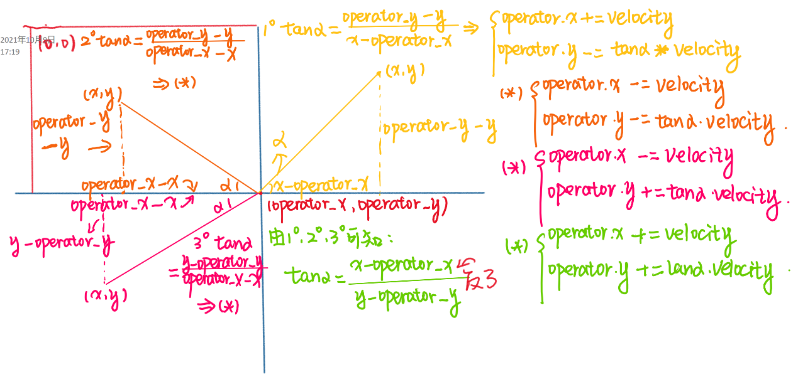

# A Python Zombie Shooting Game Based on Pygame

## 1. Program Overview  
1. This program is a top-down game where the player controls a character (referred to as the **Operator**) and interacts with the game environment through various inputs. The player uses the keyboard to move the character across the map and the mouse to control the aim of the character's weapon. The player shoots by clicking the mouse. The game includes various environmental elements (**SceneProp**) such as explosives, rocks, and trees that the player can interact with. The enemies in the game are designed to resemble “zombies,” and their behavior is modeled such that they continuously move toward the player's location. If an enemy comes into contact with the player, the player's health decreases. The player can use their firearm to shoot and kill the enemies. The game’s objective is to survive for as long as possible while fending off waves of enemy attacks.  
2. **Implementation Overview:** The game is built using the **Pygame** library, a popular game development framework in Python. (The following explanation reflects my personal understanding.) The core of mastering Pygame lies in understanding the usage and functionality of **Sprites**, which are fundamental elements in Pygame. In this program, I primarily used Pygame’s `Rect` method to define game objects. These objects are conceptually represented as rectangular areas, which serve as placeholders within the game’s logic. The `Rect` represents the object’s interaction boundary, while the actual visual representation (the image of the object) is handled by the `blit` method. This method “blits” or prints the image onto the screen based on the coordinates (`x, y`) of the `Rect`. Thus, the sprite is responsible for handling the logical behavior of the object, and the `blit` method takes care of rendering it on the screen.

## 2. Code Implementation Flow  
(Since the complexity of the program makes it difficult to visualize as a flowchart, this section provides a detailed textual description of the code flow.)  
1. **Class Design:** At the beginning of this project in early September, my skills in programming and class design were quite limited. As a result, I was unable to effectively design classes and objects, which led to several issues. One notable issue is the presence of a large number of redundant variables. For instance, the enemy’s speed (`velocity_`) and the player’s speed (`velocity`) could have been designed as properties of their respective classes (`Enemy` and `Operator`). However, in the current version of the program, these are independent, unrelated variables. Another issue is the excessive use of global variables, which makes it difficult to keep track of which variables are being modified by which parts of the program. This lack of structure significantly hinders the scalability of the program, making it harder to add new features later.  
   - `Operator` class: Represents the player. This class contains attributes such as the player’s position, health, and attack mode.  
   - `SceneProp` class: Represents interactive elements in the environment, such as rocks or explosives. Its attributes include position, health, and the effect triggered when the object is destroyed (e.g., an explosion).  
   - `Bonus` class: Represents bonus items that appear on the map. Players can interact with these objects to gain rewards, such as switching or upgrading their attack mode.  
2. **Function Design:** The functions in this program fall into two primary categories. The first category is **game functionality functions**, which implement the core features of the game. These functions take numerous parameters, encapsulating different behaviors to maintain a certain degree of modularity. For example, the function `bullet_operation` handles all bullet-related functionality, including collision detection between bullets and enemies (triggering a custom user event), bullet movement, and the creation and deletion of sprites. The purpose of encapsulating these features into functions is to improve the code's readability and maintainability.  
   The second category is **utility functions**, which serve more specific, often reusable purposes. For instance, the `collider_check` function checks whether two non-sprite **HitBox** objects overlap, i.e., performs collision detection. This function is repeatedly called throughout the game loop, improving both efficiency and clarity in the code.  
   - `Explosion_handle(explosive, timer_1)`: This function is triggered when the health of an explosive object (a subclass of `SceneProp`) drops to zero or below. It manages the explosion animation. The main game loop runs at 60 frames per second, meaning that every second, the game screen is updated 60 times. The explosion animation consists of 8 frames, and each frame is displayed for 10 iterations of the loop. Thus, the explosion animation lasts for 80 frames, or approximately 1.33 seconds.  
   - `Operator_direction(bullets_type_a, operator_x, operator_y, current_image, enemy_test, enemy_status, enemy_test_health, operator, attacking_mod_switch, explosive_list)`: This function manages the visual output of the game. It takes numerous parameters because it handles the blitting of all game objects, such as bullets, enemies, and environmental elements, onto the screen. It also handles tasks such as cursor rendering, screen filling, and simple checks (like determining whether an object exists—if it does, blit it; if not, skip it).  
   - `Bullet_operation(bullets_type_a, operator_x, operator_y, enemy_test, explosive_rect, stone, stone_rect)`: Along with `Operator_direction`, this function contains the core logic for managing non-horizontal/vertical movement in Pygame. Specifically, it handles the shooting of bullets toward the mouse position and manages bullet interactions with enemies.  
   - `death_handle(enemy_test_health)`: A straightforward utility function that checks whether an enemy’s health has dropped to zero or below, marking it as "dead."  
   - `ground_loc_variable(operator)`: This function calculates the ground height beneath the player character. Initially, the game was designed to switch between top-down and side views, similar to the gameplay of *NieR: Automata*. However, due to time constraints, this feature was ultimately removed.  
   - `gravity_and_jump_handle(keys, key_type, is_jumping, time_interval, operator)`: This function handles gravity and jumping mechanics. It was part of the scrapped side-view feature but was retained here to demonstrate its implementation. Jumping follows a parabolic trajectory modeled after free-fall physics, where velocity changes over time (with time represented by the number of game loops). The displacement is calculated using a formula that reduces the player's Y-coordinate by half the gravity constant multiplied by the square of the time interval (`operator.y -= 0.5 * gravity * (time_interval ** 2)`).  
   - `get_start_point(count)`: A simple utility function that generates a random starting coordinate.  
   - `collider_check(operator, blit_loc)`: This function checks whether two objects (specifically, non-Rect objects) are colliding. It returns a boolean value.  
   - `enemy_movement_handle(enemy_list, operator, explosive_rect_list)`: This function handles enemy movement. The enemies have basic AI, which causes them to turn toward the player and move slowly in the player’s direction, much like zombies. This simple AI was designed to enhance gameplay without overcomplicating the logic.  
   - `main()`: The main function of the program. Due to my limited programming experience, the design of this function has several weaknesses. For example, it relies on some global variables, which could have been avoided with better structuring. The main function consists of two parts: the first part initializes the class instances and defines temporary variables for timers; the second part is the game loop. The game loop uses **Pygame’s Event** system to capture and respond to user inputs, such as keyboard and mouse actions. In addition to built-in Pygame events, custom events (referred to as **USEREVENT**) can be defined to trigger specific behaviors. For example, when a bullet hits an enemy, the game triggers a custom event (`enemy_test_hit`). This event is caught in the main loop and processed to reduce the enemy's health (`enemy_health -= 1`).  
3. **Other Design Aspects:**  
   - `if __name__ == "__main__": main()`: This statement is placed at the end of the `main.py` file to ensure that the game runs when this file is executed. This is especially important when the game has multiple files or when it's packaged into an executable (`.exe`) file.  
   - The start of the program is dedicated to declaring static and global variables.

## 3. Key Code Analysis  
1. **Non-horizontal/vertical movement with constant speed:** In Pygame, the coordinate system places (0, 0) at the top-left corner of the screen, with the x-coordinate increasing to the right and the y-coordinate increasing downward. Moving an object involves adjusting its coordinates on each game loop iteration. For example, to move an object right at a speed of 60 pixels per second, the object’s x-coordinate would increase by 1 on each iteration of the 60-frame-per-second loop. However, to move an object diagonally, both the x and y coordinates must change simultaneously. The key is to determine the mathematical relationship between these two variables.  
2. **Bullet trajectory aimed at the mouse:** The bullets in this game are fired toward the position of the mouse, which involves some trigonometric calculations. The bullet's direction is determined using the mouse’s coordinates and the player’s position.  
3. **Mathematical Explanation:** The function `pygame.mouse.get_pos()` is used to get the current coordinates of the mouse. These coordinates are treated as the target position, with the player’s position being the origin. By analyzing the angles between the player and the mouse, we can compute the required speed components for both the x and y directions. This allows for smooth bullet movement in any direction, not just along horizontal or vertical lines.  
4. **Algorithm’s Creativity and Advantages:** Since Pygame is not as popular as other commercial game engines, there is limited information available in both English and Chinese forums regarding free object movement in Pygame. Some developers have achieved similar functionality by creating custom vector classes. However, using trigonometric functions to calculate movement offers a simpler and more intuitive solution. The downside is that it requires more manual calculation and logical branching based on the angle of movement.

## 4. Additional Notes & Conclusion  
- The project began in early September and took a long time to complete. However, the final product falls short of the full feature set that was originally planned. The primary issue lies in my limited understanding of class and object design, which led to a messy variable structure.  
- In reality, Python’s strengths lie more in fields such as web scraping and machine learning than in game development. During my time as a student under Professor Sun Xuting, I developed a web scraper in Python to collect flight data from several U.S. airlines for the years 2018-2019. The script is purely functional, with no graphical interface and limited interactivity. Because this game project does not showcase Python’s competitive advantages in fields like data analysis, I have also submitted my flight information scraper as part of this semester’s project. This scraper requires the **Selenium** library and **WebDriver** plugin, as well as a Virtual Private Network (VPN) to access U.S.-based websites efficiently.